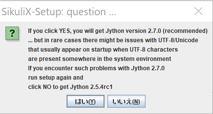
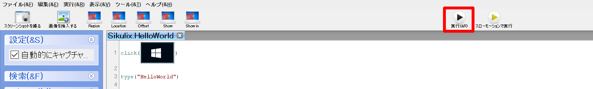

# 🔰Sikulixを触ってみる(Windows10)

## 🔰Sikulixの公式サイトとか

- [SikuliX by RaiMan](http://sikulix.com/)
- [github - RaiMan/SikuliX-2014](https://github.com/RaiMan/SikuliX-2014)
- [Sikuli / SikuliX Documentation for version 1.1+ (2014 and later)](http://sikulix-2014.readthedocs.io/en/latest/)

## 🔰Sikulixとはなんぞや？

SikuliXは、Windows、Mac、またはLinux / Unixを実行しているデスクトップコンピュータの画面に表示されるものをIntelがOSSでやってるOpenCVという画像処理ライブラリを利用して自動化するツール。

Sikulixを利用すると、テストの自動化とか色々とできて便利らしい。

あと最近流行り？　のRPAとは名乗ってないけれどRPA的な事も出来る。

(RPAの厳密な定義もあるのかどうかよくわかりませんが……)

なおSikulixの処理は

- Python (Jython) (preselected) allows scripting using Python language level 2.7 (internally used interpreter Jython 2.7 )
- Ruby: scripting using Ruby language level 1.9 (internally used interpreter JRuby 1.7.x )
- java

でコーディングできる。デフォルトはpythonの様子。

## 🔰SikuliとSikulix

ネットで検索するとSikuliとSikulixの２つが引っかかる。

[SikuliX by RaiMan](http://sikulix.com/)のSikuli is God's Eyeを見ると。

- Sikuliは2009年にMITのUser Interface Design Groupが始めたOSS。
- sikuliは2012年でプロジェクトを終了し、開発とサポートをsikulixに引き継いだ。

らしい。

ちなみにsikuliのリポジトリは[github - sikuli](https://github.com/sikuli/sikuli)。

こちらはもう更新される事はないでしょう。

というわけで、現在はSikulixの情報を収集して利用すれば問題ありません。

## 🔰Sikulixの利用環境構築

本資料でインストールする環境は

- Windows10
- Sikulix Version 1.1.1
- java version "1.8.0_144"
- Java(TM) SE Runtime Environment (build 1.8.0_144-b01)
- Java HotSpot(TM) Client VM (build 25.144-b01, mixed mode)

[SikuliX Quickstart](http://sikulix.com/quickstart/)にWindows/Mac OSX/Linux/Unixそれぞれのクイックスタート資料があるのでこれを参考にインストールを行う。

chocolateyにも一応パッケージが存在するが、versionが1.1.0と少し古いものだったので本資料では公式サイトからダウンロードしてインストールを行った。

- [chocolatey -SikuliX](https://chocolatey.org/packages/sikulix)

### 🔰前提条件確認

Sikulixを動かす前提条件として、Versionの1.1.1では

>In any case you must have a valid Java installation of at least Java 7 (JRE (runtime only) or JDK (runtime + development kit)).

らしいのでjava -versionで環境確認。  

OK。条件を満たしてない場合はjavaをインストールして下さい。

- Real Screen needed
- Using Virtual Machines
- Machine not useable in parallel while SikuliX scripts or programs are running

### 🔰Sikulixのダウンロードとインストール

[SikuliX Quickstart](http://sikulix.com/quickstart/)にしたがって、該当Versionのダウンロードを行う。（本資料では1.1.1）

本資料でのインストール先は`c:\tools\sikulix`としたので下記のようにダウンロードしたファイルを配置。  
(どうやらsikulixはsikulixsetup-1.1.1.jarを置いたディレクトリにイントールするっぽい？)  

インストールディレクトリに配置したsikulixsetup-1.1.1.jarを実行して、

はい  

必要な物にチェックを付ける。

チェックについての詳細はHボタンを押すか、[3.How do I set up SikuliX](http://sikulix.com/quickstart/#qs3)に書いてあります。

下記画像ではpythonとかrubyとかjavaとか、そのうち触ってみようかな？　という思惑で適当にチェックを付けてますが。
普通に触る分にはデフォルトのpythonだけで十分な気がします。  

はい  

はい  

OK  

OK  

インストール完了  

## 🔰Sikulix IDEの起動

[4.Getting started with SikuliX IDE](http://sikulix.com/quickstart/#qs4)

意外と公式サイトに丁寧に説明が書いてあります。（上記参照）

今回はrunsikulix.cmdを実行して起動してみる。

Sikulix IDEが起動しました。ここでSikulixの処理を記述していきます。  

## 🔰まずは公式ドキュメントにあるHelloWorldをやってみる

[Hello World (Windows)](http://sikulix-2014.readthedocs.io/en/latest/tutorials/helloworld/helloworld-win.html)

SikulixのドキュメントにそのものずばりのHelloWorldという例があるのでやってみる。

### 🔰スクリプトのドキュメントは下記にあるので使い方はここをみればOK

- [SikuliX API for scripting and Java programming](http://sikulix-2014.readthedocs.io/en/latest/#sikulix-api-for-scripting-and-java-programming)

### 🔰Windowsボタンを探してクリックして、HelloWorldとタイプするSikulixスクリプトを作成する

まずは現在開いているSikulix Scriptが無題となっているのでHelloWorld用として保存する。  

今回はデスクトップにSikulix.HelloWorldとして保存してみた。  

赤枠のスクリーンショットボタンを押すと、スクリーンショットを取得するモードとなるのでWindowsボタンを範囲選択する。

スクリーンショットを取る  

Windowsボタンを範囲選択  

IDEのコーディング部分に画像が挿入された。  

今回はこの画像をクリックさせたい。

click()で囲んでやるとクリックする。

クリックした後の動作として文字列のタイプを行うのは。

type("文字列")で指定する。

type("HelloWorld")

と直接入力してもよいが、赤枠の部分をクリックすると自動でそれぞれの処理が挿入されたりする。  

textとなっている部分を"HelloWorld"に変更して保存  

## 🔰Sikulixスクリプトの実行

**（実行ボタン）**　や　**（メニュー　-> 実行）**　から実行する。

マウスが動きだして、WindowsボタンをクリックしてHelloWorldとタイプします。  

## 🔰実行動作

ウィンドウズボタンが画像認識されて、マウスカーソルが自動的に誘導される。

Windowsボタンにマウスが移動してクリック  

typeで **helloworld** とキー入力が行われる。  

ウィンドウズボタンを押した後の検索テキストにhelloworldと入力されて処理は完了。

## 🔰今回作成されたSikulixスクリプトファイル群

## 🔰総評

SikulixIDEでさっくりとコーディングできるのでかなりとっつきやすい印象を受ける。

処理の完了を検知するとかは特定画像が表示されるまで待てばよい。　という方法が使えるのでプロセスを検知したら、トリガが発生したらという従来の方法にとらわれない検知が可能な点が面白い。

SikulixIDEのコーディング画面には画像が入って来るのでなかなか見た目のインパクトが強いですね。
